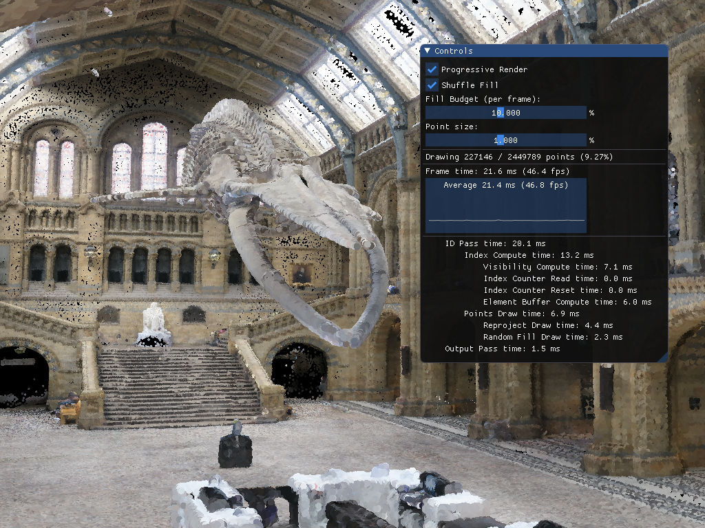

# pcr

Basic implementation of ['Progressive Real-Time Rendering of Unprocessed Point Clouds'](https://www.cg.tuwien.ac.at/research/publications/2018/schuetz-2018-PPC/schuetz-2018-PPC-abstract.pdf) [Markus Schuetz, Michael Wimmer]

[Video (Youtube)](https://www.youtube.com/watch?v=iuYOooGQZ7U&)

## Dependencies
- [tinyply](https://github.com/ddiakopoulos/tinyply)
- [dear imgui](https://github.com/ocornut/imgui)

## Screenshots

